# LibraryMnagementSystem
This is a library management system made by core java , the following technologies were used :
- Jave.
- MySql.
# Prerequisites
- Java JDK.
- NetBeans Editor.
- MySql.

# Functions
The project has two interaces in general : 
1. Login Interface for administrator.
   - Admin login to manage books and members.
2. Admin Interface : 
   * For manage all function in library.  
         2.1 Add Book. 
         2.2 Delete Book. 
         2.3 Edit Book. 
         2.4 Display All Books. 
         2.5 Add Author. 
         2.6 Add Category. 
         2.7 Add Member. 
         2.8 Delete Member. 
         2.9 Edit Member. 
         2.10 Display All Members. 
         2.11 Buy Books. 
         2.12 Borrow Books. 
         2.13 Return Borrowed Books.<br/
  
  # Login Interfce
  
  
  # Admin Interface
   * Welcome System
    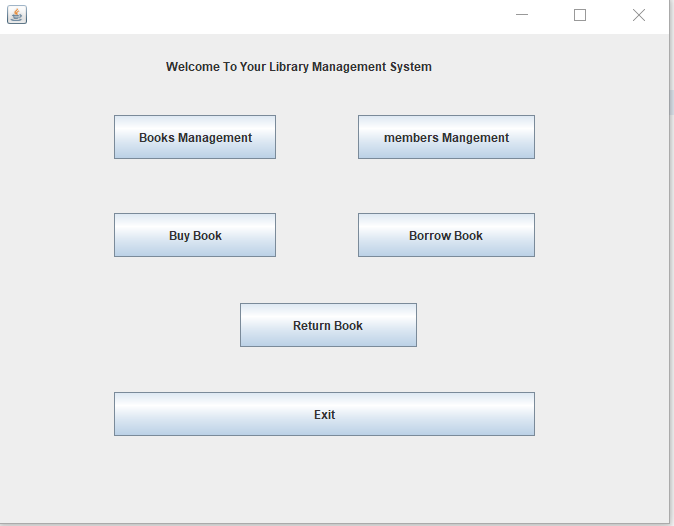
    
   * Add Book
     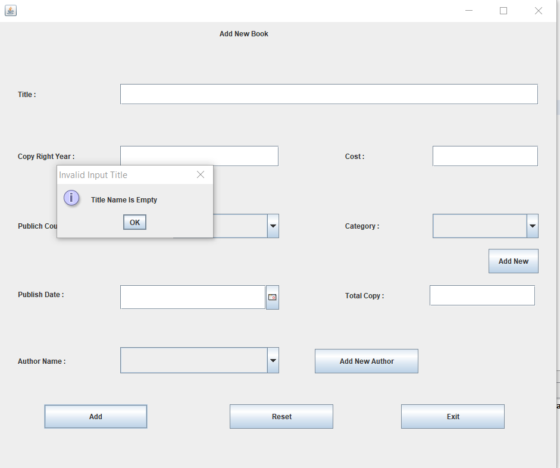
     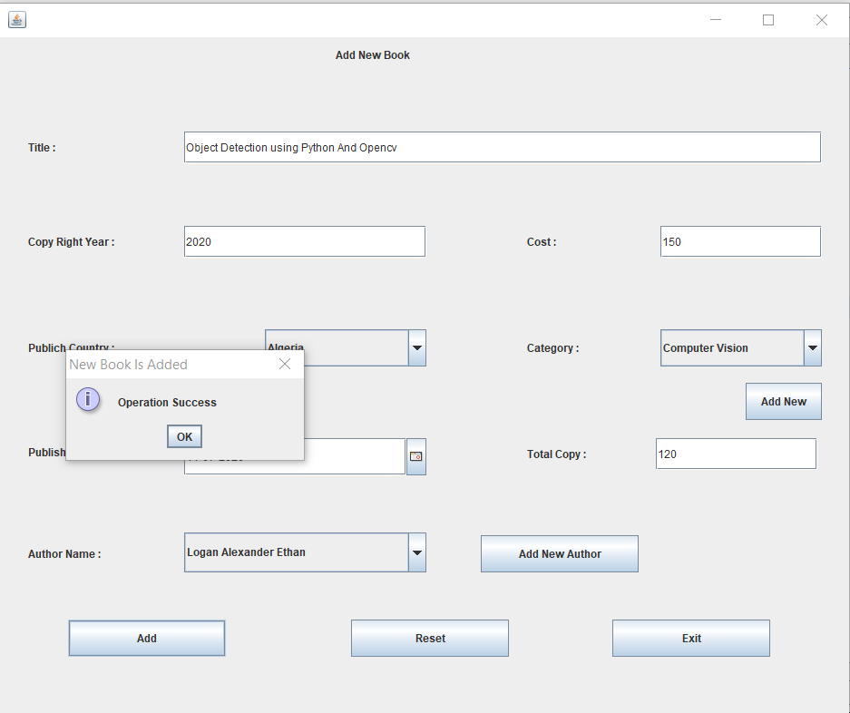
    
   * Delete Book
   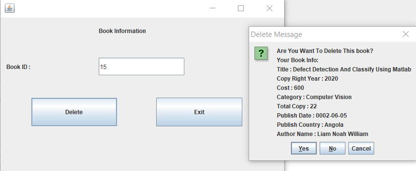
   
   * Edit Book
   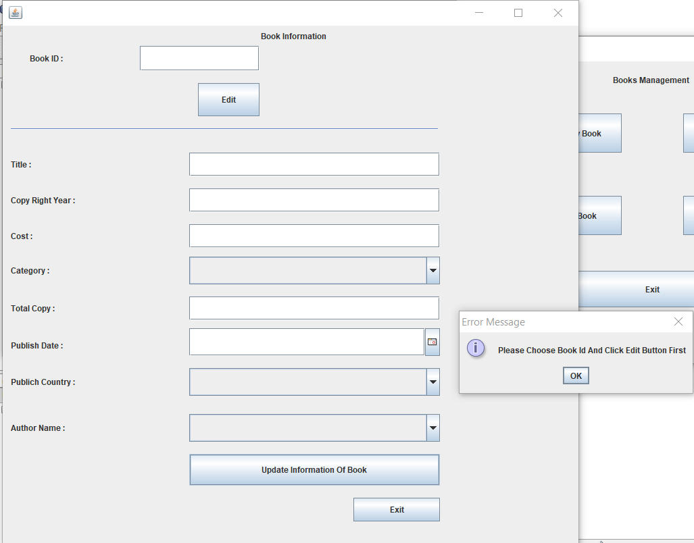
   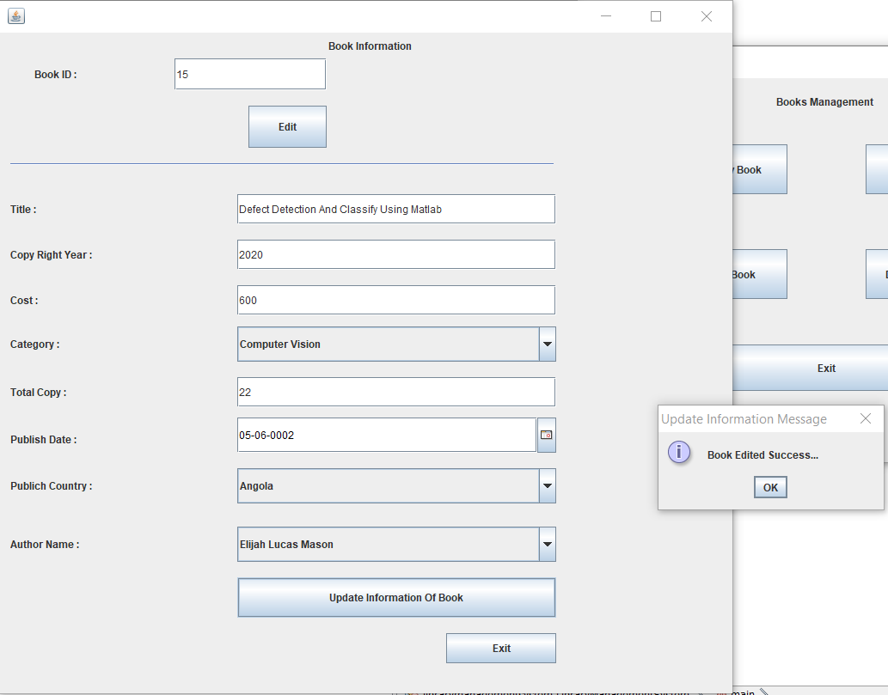
   
   * Display All Books
   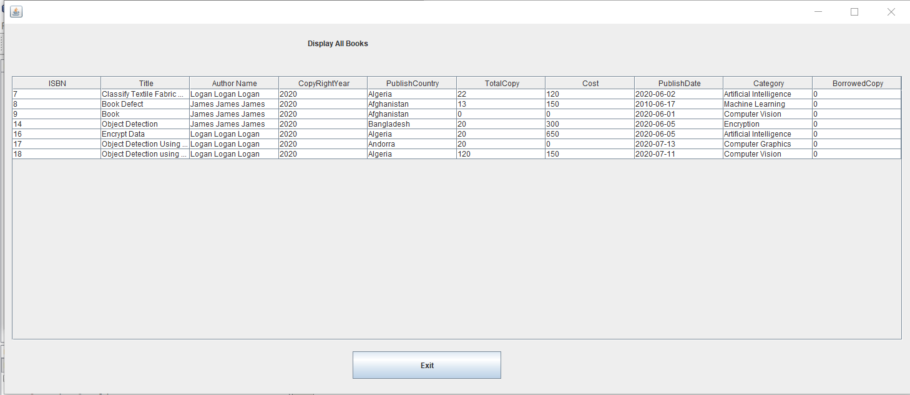
   
   * Add Member
   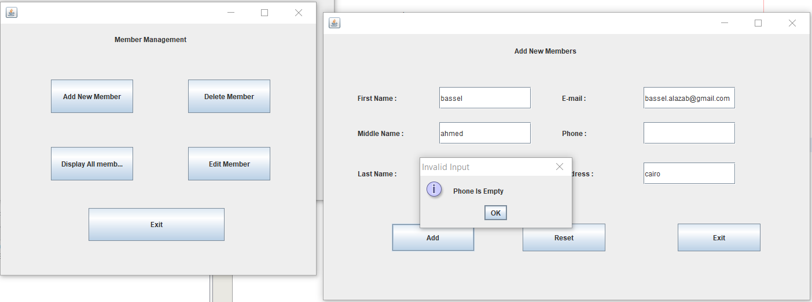
   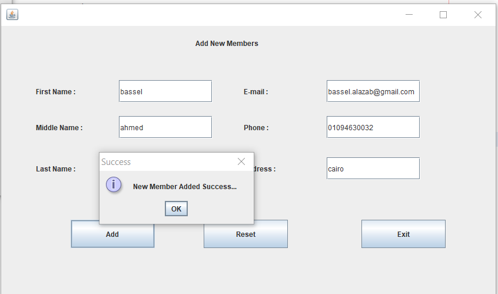
   
   * Delete Member
   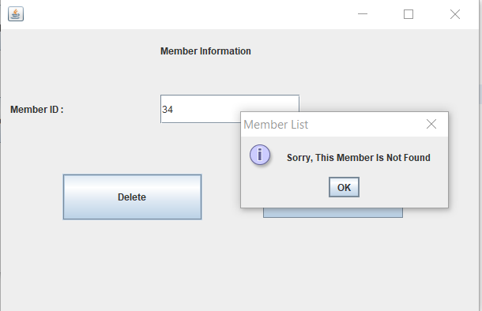
   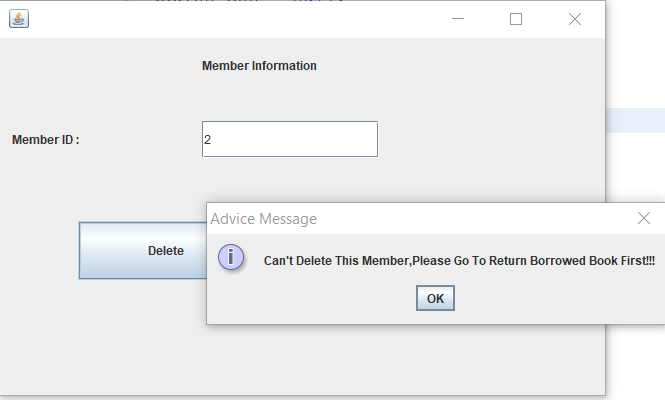
   
   * Edit Member
   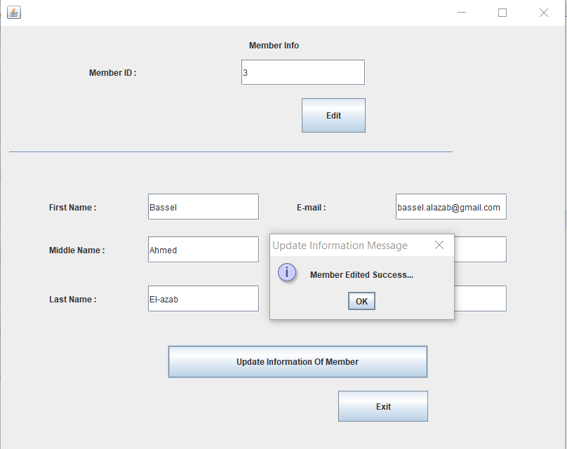
   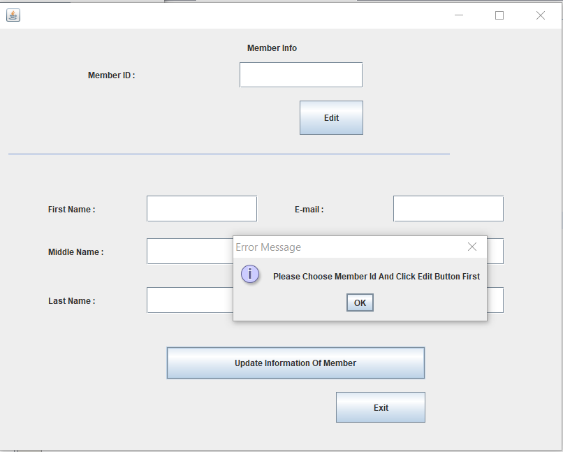
   
   * Display All Members
   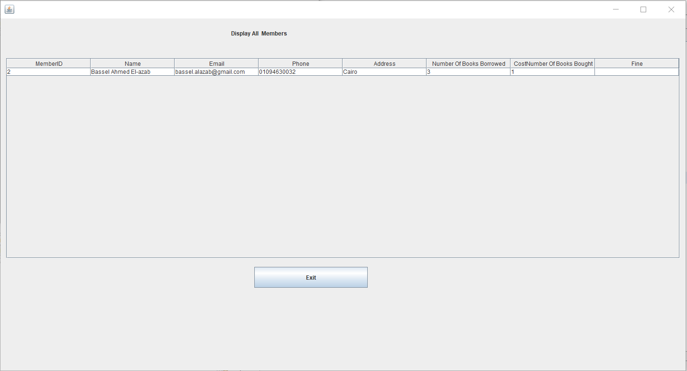
   
   * Buy Books
   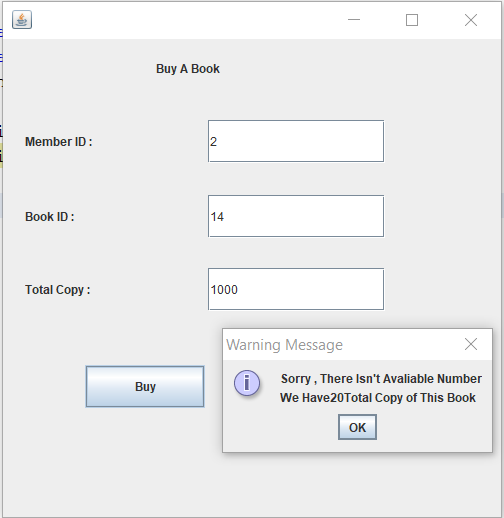
   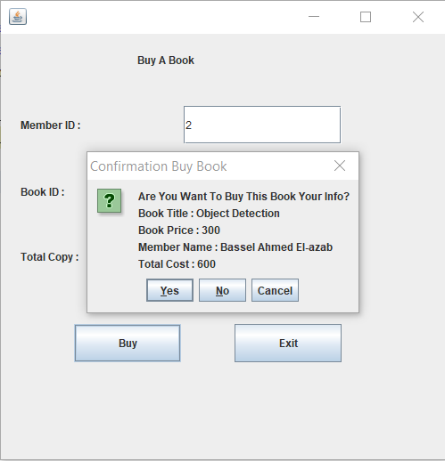
   
   * Borrow Books
   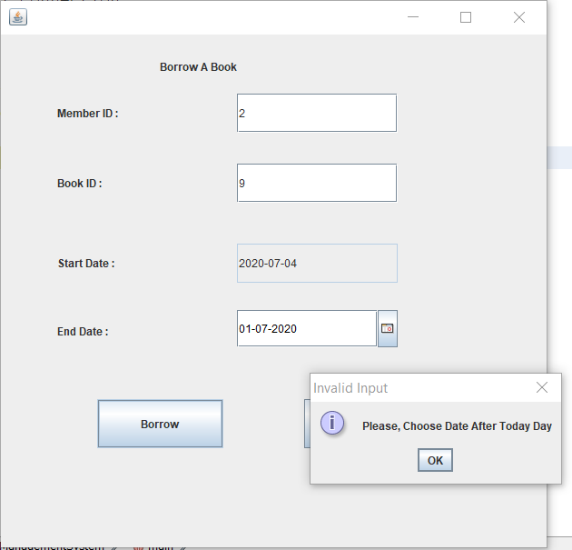
   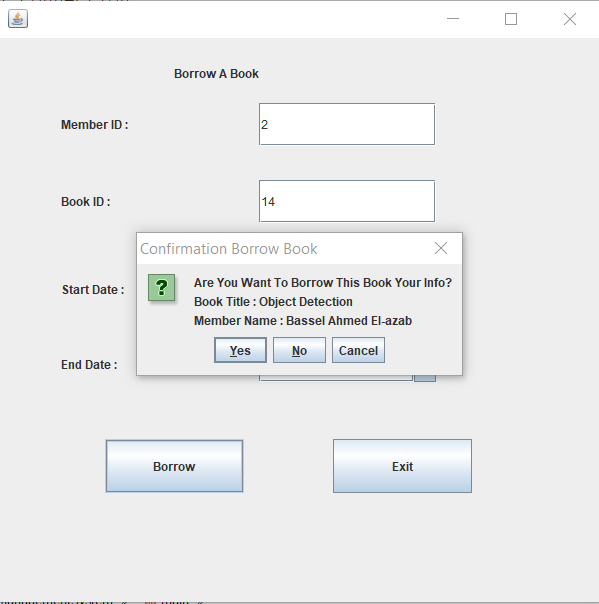
   
   * Return Books
   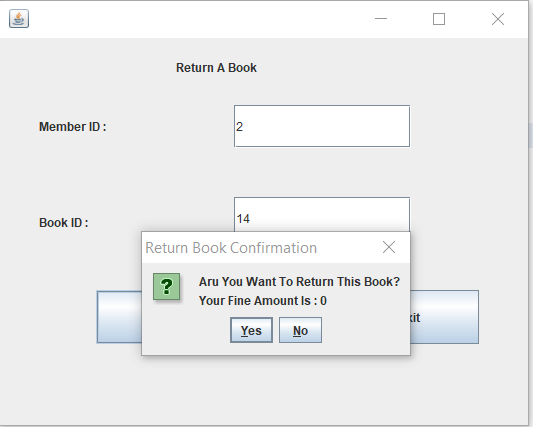

