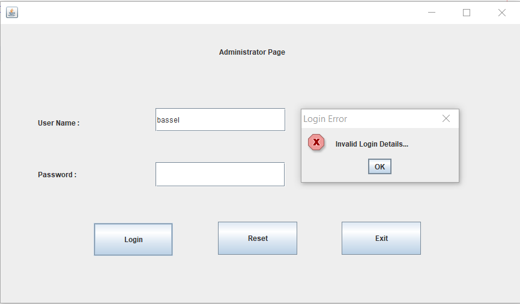

# LibraryMnagementSystem
This is a library management system made by core java , the following technologies were used :
- Jave.
- MySql.
# Prerequisites
- Java JDK.
- NetBeans Editor.
- MySql.

# Functions
The project has two interaces in general : 
1. Login Interface for administrator.
   - Admin login to manage books and members.
2. Admin Interface : 
   * For manage all function in library.
      2.1. Add Book.

  
  # Login Interfce
  
  
